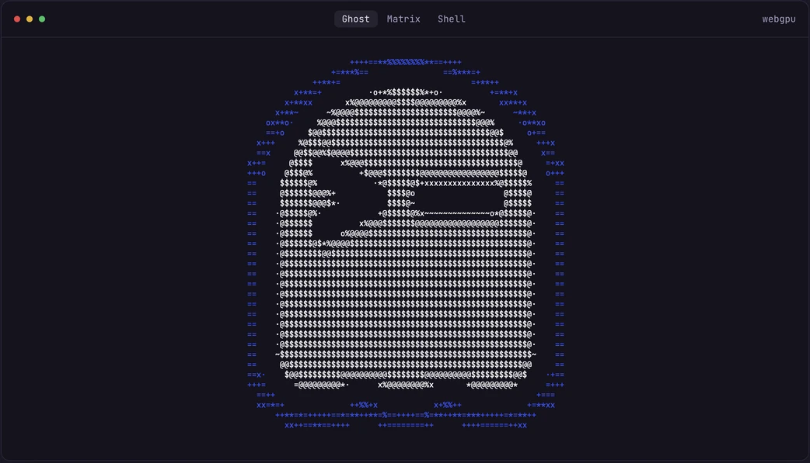

[](https://shaullavo.github.io/ghostty-webgpu/)

# ghostty-webgpu

an unofficial ghostty for the web, inspired by [ghostty-web](https://github.com/coder/ghostty-web) and powered by libghostty-vt

damage-aware rendering with webgpu, webgl2, canvas2d, and dom fallbacks. still a preview

## try it

[open the live demo](https://shaullavo.github.io/ghostty-webgpu/)

```sh
npm install ghostty-webgpu
```

```html
<div id="terminal" style="height: 32rem; width: 100%"></div>
```

```ts
import { Terminal } from 'ghostty-webgpu'

const host = document.getElementById('terminal')!
const terminal = await Terminal.create()
await terminal.open(host)
terminal.write('hello from ghostty\r\n')
terminal.focus()
```

call `terminal.dispose()` when you're done. [connect a websocket pty](docs/integration.md) for a real shell

## what's in it

- redraws only changed cells, with gpu rendering and canvas and dom fallbacks
- byte-based pty traffic, automatic fitting, and live themes
- selection, scrollback, links, and unicode text

scrollback uses native page-granular line and byte budgets. [retention and actual row counts](docs/api.md#scrollback-retention)

## benchmarks

Reviewed 2026-10-08 on an Apple M1 MacBook with AC power and headed Chrome 154.0.8037.93. Frozen ghostty-webgpu 0.3.20 vs xterm.js 6.0.0, WebGL addon 0.19.0. Seventeen visible 40 × 12 terminals, DPR 2, 120 warm-up ticks and 900 measured ticks at 60 Hz. Medians of balanced paired runs. Each ratio is ghostty divided by xterm.js; below 1 means ghostty uses less.

| Renderer pair           | Workload                  | CPU energy ratio | Instruction ratio |
| ----------------------- | ------------------------- | ---------------: | ----------------: |
| WebGL vs xterm.js WebGL | Heavy log output          |            0.751 |             0.690 |
| WebGL vs xterm.js WebGL | Heavy Unicode output      |            0.730 |             0.689 |
| WebGL vs xterm.js WebGL | One Unicode line per tick |            1.320 |             1.348 |
| WebGL vs xterm.js WebGL | One ASCII line per tick   |            1.361 |             1.417 |
| WebGL vs xterm.js WebGL | Typing-like edits         |            1.010 |             1.048 |
| DOM vs xterm.js DOM     | Heavy log output          |            0.375 |             0.445 |
| DOM vs xterm.js DOM     | One Unicode line per tick |            0.392 |             0.497 |
| DOM vs xterm.js DOM     | One ASCII line per tick   |            0.735 |             0.839 |
| DOM vs xterm.js DOM     | Typing-like edits         |            1.147 |             1.151 |

CPU energy is macOS's estimate for the Chrome process family, including GPU-process CPU work. GPU-device and display energy are outside its scope. WebGL heavy output finishes at 8,841 matching history rows; intermediate history differs. DOM heavy logs retain the full stream; default rolling and Unicode surfaces differ. DOM scrolling and edits use normalized grids. These are reviewed whole-terminal observations with limits. WebGL loses on line-by-line output, and DOM loses on typing-like edits.

[Method, review limits, raw counters and reproduction commands](https://github.com/ShaulLavo/ghostty-webgpu/blob/main/docs/benchmarks.md). Canvas, WebGPU, current parser throughput, whole-browser memory and presentation latency await fresh reviewed results.

## more

[pty wiring](docs/integration.md) · [api, workers, and rendering](docs/api.md) · [fonts](docs/font-geometry.md) · [hotkeys](docs/hotkeys.md) · [native config](docs/config-resolver.md)

development happens in [fregat](https://github.com/ShaulLavo/fregat/tree/main/ghostty-webgpu). this repo mirrors its `ghostty-webgpu/` folder; submit changes there

ghost artwork from [ghostty.org](https://ghostty.org), used under its mit license
